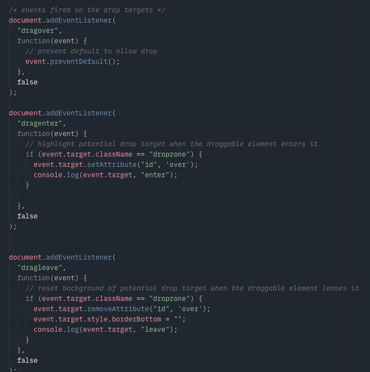

# Playlist Editor

An HTML/CSS/JS prototype of a playlist editor.

## Getting Started
- Fork the [repo](https://github.com/VincentKempers/frontendvoordesigners.git).
- To run it locally you only need a browser and run the index.html

## User Feedback Test

_Tests will be conducted on 11-02-2019_

### coding style

## Deployment

it's hosted on GitHub Pages.

## Built With
  - HTML5
  - CSS3
  - JavaScript

## Authors

* **Vincent Kempers** - [Github](https://github.com/vincentkempers) - [Twitter](https://twitter.com/vincentkempers)

## License

This project is licensed under the MIT License - see the [LICENSE.md](LICENSE.md) file for details
